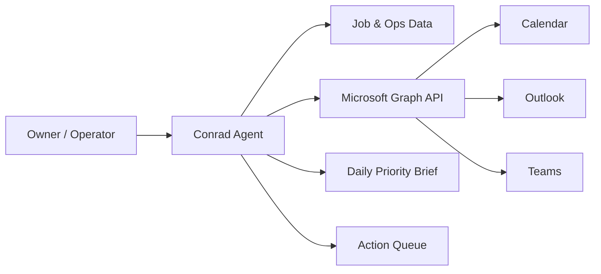

# Conrad AI Assistant

Conrad is an autonomous operations assistant designed for a residential finish carpentry business. It helps the owner-operator reduce mental overhead by turning incoming information into clear next actions, tracking commitments, and keeping project execution moving.

This repository demonstrates a legitimate, practical automation project with clear Microsoft 365 integration intent. The goal is not generic AI experimentation; the goal is production-grade workflow support for daily business operations.

## Why Microsoft 365 Access Is Needed

Conrad uses Microsoft 365 and Microsoft Graph for real operating workflows:
- **Calendar coordination** to detect conflicts, protect build/install windows, and support day planning
- **Outlook triage** to surface urgent vendor/client threads and create follow-up queues
- **Teams notifications** for crew-facing alerts and time-sensitive coordination

These are direct business functions tied to scheduling, communication, and execution continuity.

## Current Development Status

This project is in active development with staged implementation:
1. Core assistant workflow and data routing
2. Microsoft Graph read-first integration
3. Controlled write actions (explicit user confirmation)
4. Reliability hardening and auditability

See `docs/roadmap.md` and `CHANGELOG.md` for current progress and next milestones.

## Tech Stack

- OpenClaw agent runtime
- Node.js 22+
- Microsoft Graph API (delegated auth)
- MSAL authentication flow
- JavaScript/TypeScript-ready structure

## Operator Context

Built for a small, fast-moving construction operation where decisions are frequent and delays are expensive. Conrad is designed to provide high-signal operational guidance, not novelty output.

## Architecture

## Repository Layout

- `docs/` architecture, API usage, security, roadmap
- `src/` core agent logic, integrations, skill stubs
- `tests/` integration and baseline test scaffolds
- `.github/workflows/` lightweight CI
- `examples/` concrete workflow demonstrations

## Security and Governance

- Least-privilege scope strategy
- Read-first rollout
- Explicit confirmation for outbound/mutating actions
- Local secret/token handling; no committed credentials

## License

MIT (see `LICENSE`).
