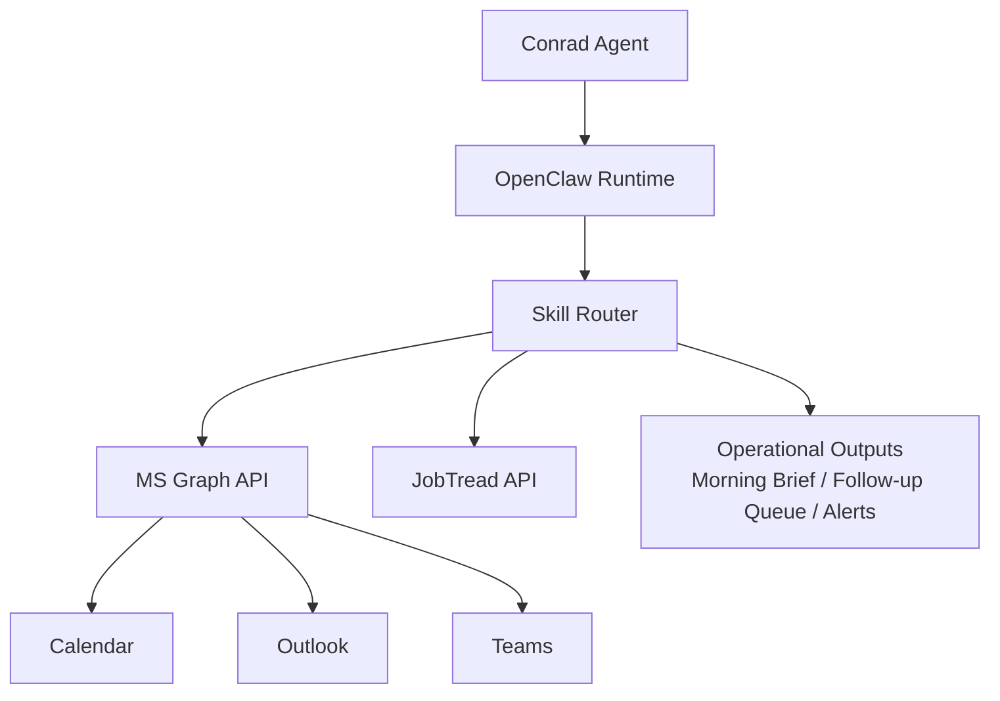

# Architecture

Conrad is an operations assistant running inside OpenClaw with skill-based routing and controlled external integrations.

## Notes
- Skill Router determines whether an action is internal analysis, JobTread read, or Microsoft Graph interaction.
- Microsoft Graph operations are delegated-auth first with least-privilege scopes.
- External write actions are gated behind explicit user confirmation.
